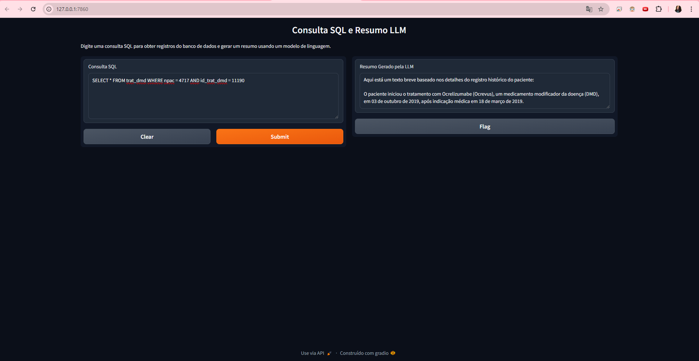

# Projeto em Ciência de Dados II

## Introdução
No semestre de 2024/1 fui aluna da cadeira de Projeto em Ciência de Dados II, uma cadeira extensionista que visa trazer casos reais para aplicação de Data Science e Machine Learning.

O presente repositório contém a solução proposta para o obejtivo #2, citado em [Objetivos do Projeto](#objetivos-do-projeto). Para entendiemento do contexto do projeto, segue a descrição do Business Case enviado pela Escola de Medicina da PUCRS, a parceira da edição em que participei.

### Contexto do Business Case
 
> Ao longo das últimas décadas, consolidou-se na medicina decisões baseadas em evidências científicas robustas, sempre que possível, fundamentadas em ensaios clínicos randomizados e/ou em meta-análises. Esses estudos, apesar de agregarem grande segurança nas decisões médicas são muito caros e trabalham com populações que, muitas vezes, não refletem os achados de um número significativo dos pacientes. A partir disso, tem sido estimulado, nos últimos anos, o uso de estudos de vida real, baseados em grandes bases de dados populacionais. A plataforma BRANDO foi construída com esse intuito e conta hoje com mais de 4.400 pacientes brasileiros e de outros países da América Latina. Vários dos pacientes incluídos nesse banco, contudo, já são acompanhados há vários anos, tendo ao todo milhares de consultas não estruturadas nos prontuários médicos o que torna extremamente trabalhosa (talvez impossível...) sua transferência integral para a base de dados. É importante ressaltar ainda que ao final de cada consulta, o BRANDO cria um relatório estruturado que pode ser anexado no prontuário médico, permitindo sua utilização simultânea para assistência e pesquisa. A criação de uma ferramenta de inteligência artificial (AI) que possibilite a transformação dos achados da consulta médica para um formato estruturado, para transferência posterior para dentro da base de dados, potencializará e agilizará as pesquisas advindas desses dados. Por fim, do ponto de vista de negócio, isso poderá servir de base para a construção de outras ferramentas de AI, assim como permitirá a ampliação e a elaboração de novos bancos de dados em diferentes áreas da medicina.

### Objetivos do Projeto
1.	Transformação automática de dados não estruturados de prontuários médicos assistenciais em dados estruturados para serem incluídos na base de dados BRANDO de pacientes com esclerose múltipla.
2.	Permitir que o dado estruturado gerado no final da consulta possa ser transformado em um texto descritivo, mediante o emprego de ferramenta similar ao ChatGPT.

## Solução Proposta

## UI
A Interface de Usuário para interagir com a solução foi construída com o framework [Gradio](https://www.gradio.app/). A interface permite que o usuário insira sua query SQL e visualize o resultado da consulta em forma de texto descritivo sobre o paciente segundo as informações disponíveis no banco de dados.

#### Nota

Por motivos de confidencialidade, os dados de pacientes e consultas não podem ser disponibilizados neste repositório, bem como API keys e credenciais de acesso.